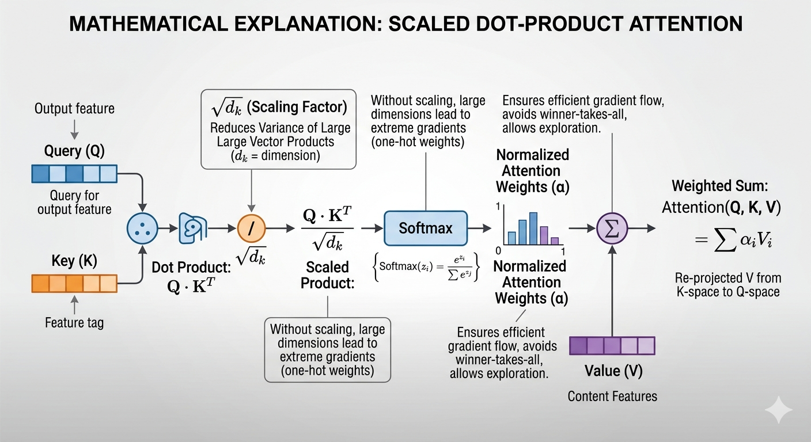
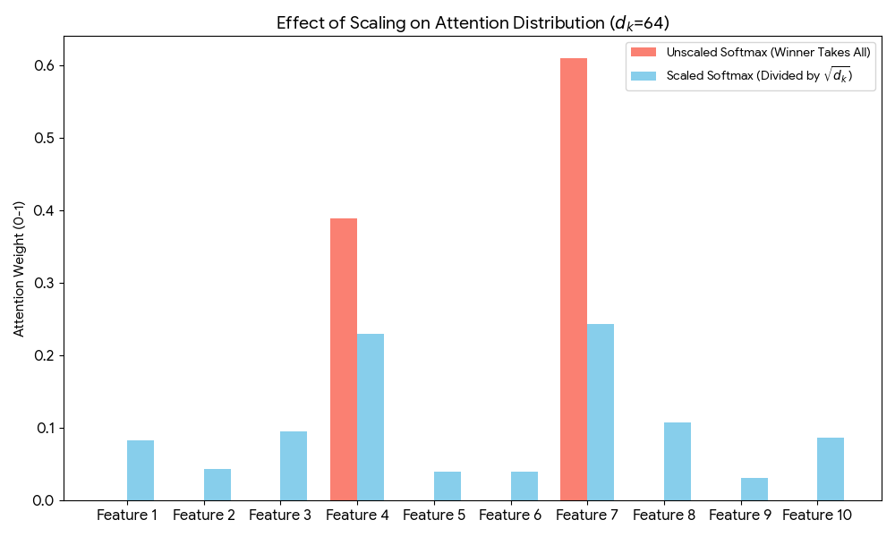

# Transformer_Practice
Inspired by my friend Jerry for his work transformer-from-scratch



## Part 1: Model Building Considerations

### QKV Projection (Feature Mapping)
* **$Q = X_{target}W_Q \implies$** Target output feature space.
* **$K = X_{source}W_K \implies$** Input feature index.
* **$V = X_{source}W_V \implies$** Input feature content.
* **Projection** via correlation matrix: $QK^T$.

### Attention Routing (Self vs. Cross)
* **Self-Attention**: $X_{target} = X_{source} \implies Q, K, V$ derived from the same sequence.
* **Cross-Attention**: $X_{target} \neq X_{source} \implies Q$ from Decoder, $K, V$ from Encoder.

### Multi-Head Attention (Feature Decoupling)
* Split channel dimension $d_{model}$ into $h$ independent chunks: $d_k = d_v = \frac{d_{model}}{h}$.
* $\text{Head}_i = \text{Attention}(Q W_Q^{(i)}, K W_K^{(i)}, V W_V^{(i)})$
* $\text{MultiHead}(Q,K,V) = \text{Concat}(\text{Head}_1, ..., \text{Head}_h) W_O$
* **Purpose**: Reduces feature confusion by calculating similarity weights in orthogonal subspaces.

### Scaled Dot-Product (Variance Control)
* Assume $q, k$ have mean $0$, variance $1$.
* $\text{Var}(q \cdot k) = \text{Var}(\sum_{i=1}^{d_k} q_i k_i) = d_k$.
* Scaling ensures unit variance: $\text{Var}(\frac{q \cdot k}{\sqrt{d_k}}) = 1$.

### Softmax Normalization (Gradient Distribution)
$$\text{Attention}(Q, K, V) = \text{softmax}\left(\frac{QK^T}{\sqrt{d_k}}\right)V$$
* $\text{softmax}(x_i) \in (0, 1)$.
* **Purpose**: Prevents saturation (winner-takes-all). Maintains $\frac{\partial L}{\partial x_i} > 0$ for non-dominant features, enabling gradient exploration.

```python
# The scaling operation (dividing by the square root of d_k) is achieved 
# by this specific line in the MultiHeadAttention class:

wei = q @ k.transpose(-2, -1) * (self.head_size ** -0.5)

# ---------------------------------------------------------
# Math to Code Mapping:
# ---------------------------------------------------------

# 1. q @ k.transpose(-2, -1)
#    This calculates the dot product between the Query and the Key.
#    Mathematical equivalent: Q * K^T

# 2. self.head_size (represented as 'C' in your original code)
#    This represents the feature dimension of a single Attention Head.
#    Mathematical equivalent: d_k

# 3. ** -0.5
#    In Python, raising a value to the power of -0.5 is mathematically 
#    equivalent to taking its square root and placing it in the denominator.
#    Mathematical equivalent: x^(-0.5) = 1 / sqrt(x)

# Conclusion:
# This single line of code perfectly translates the Scaled Dot-Product formula:
# (Q * K^T) / sqrt(d_k)
```
### Layer Normalization (Scale Alignment)
* **Pre-Norm (Stable/Modern)**: $x_{out} = x + \text{Sublayer}(\text{LayerNorm}(x))$. Protects direct identity gradient path $\nabla x = 1$.
* **Post-Norm (Unstable)**: $x_{out} = \text{LayerNorm}(x + \text{Sublayer}(x))$. Scale misalignment between different Q and K/V sources causes vanishing/exploding gradients.


---

## Part 2: UMPIRE Interview Strategy

* **Understand (I/O Baseline)**:
    * **Test**: $X_{in} \to Y_{out}$ mapping.
    * **Condition**: If $X_{in} \equiv Y_{out} \implies \text{Self-Attention}$. If $X_{in} \neq Y_{out} \implies \text{Cross-Attention}$.
* **Match (Variable Assignment)**:
    * **Test**: Define inputs for $\text{CrossAttn}(Q, K, V)$.
    * **Condition**: Must identify $Q = X_{Decoder}$ and $K, V = X_{Encoder}$.
* **Plan (Multi-Head Justification)**:
    * **Test**: Why use $d_k = \frac{d_{model}}{h}$ instead of full $d_{model}$?
    * **Condition**: Must articulate feature decoupling (calculating $\text{softmax}(q_i \cdot k_i)$ per subspace chunk) over monolithic vector averaging.
* **Implement (Variance Scaling)**:
    * **Test**: Explain the $\frac{1}{\sqrt{d_k}}$ term.
    * **Condition**: Must derive $\text{Var}(\sum q_i k_i) = d_k$ and explain variance explosion as dimensions grow.
* **Review (Gradient Saturation)**:
    * **Test**: Explain Softmax behavior without $\sqrt{d_k}$.
    * **Condition**: Must explain that large variance pushes $\text{softmax}(x) \to 1$ or $0$, causing $\frac{\partial \text{softmax}}{\partial x} \to 0$ (vanishing gradients/loss of exploratory directions).
* **Evaluate (Norm Placement)**:
    * **Test**: Pre-Norm vs. Post-Norm in Cross-Attention.
    * **Condition**: Must identify that $\text{Var}(Q) \neq \text{Var}(K)$ requires Pre-Norm to align scales before the $QK^T$ dot product to stabilize $\nabla W$.

---

## A Simple Example: Cross-Attention in Translation

Let's say the model is translating English to Chinese.
* **Source (Encoder)**: "I ate a red apple."
* **Target (Decoder)**: "我吃了一個紅____" (The model is trying to predict "蘋果").

### How the QKV math maps to reality:
1.  **Q (Query) from Decoder**: The Decoder knows it just output "紅" (red). Its Query represents what it wants next: something edible, red, and a noun.
    * $Q = [\text{edible}, \text{red}, \text{noun}]$
2.  **K (Key) from Encoder**: The Encoder holds the "index tags" for all the English words.
    * $K_{\text{apple}} = [\text{edible}, \text{red}, \text{noun}]$
    * $K_{\text{I}} = [\text{human}, \text{pronoun}, \text{subject}]$
3.  **V (Value) from Encoder**: The actual rich contextual features of those English words.
    * $V_{\text{apple}} = [\text{Core semantic meaning of "apple"}]$

### The Execution:
* **Match ($QK^T$)**: The Decoder asks the Encoder, "Who matches my Query?" $Q \cdot K_{\text{apple}}$ yields a very high similarity score.
* **Scale ($\frac{1}{\sqrt{d_k}}$)**: Shrinks the massive dot product sum to prevent "winner-takes-all" behavior.
* **Distribute (Softmax)**: Converts scores into probabilities (e.g., 0.95 for "apple", 0.05 for others), allowing gradient exploration.
* **Retrieve ($\text{Softmax} \times V$)**: The model pulls $V_{\text{apple}}$ into the Decoder to successfully output "蘋果".

---

# Transformer 原理解析

### 1. QKV 的特徵投影與關聯
* **Q (Query) 的本質**：代表「輸出特徵」的要求，即當前位置想要尋找什麼樣的資訊。
* **K (Key) 的本質**：代表「輸入特徵」的索引或標籤，用來與 Q 匹配以計算關聯性。
* **V (Value) 的本質**：代表實質的「內容特徵」。
* **運作機制**：透過 $QK^T$ 形成關聯矩陣（Attention Map），將 V 從 K 的特徵空間投影到 Q 的特徵空間，達成資訊的加權提取。

### 2. Softmax 在正規化中的優勢
* **權重分佈**：將關聯度縮放到 $[0, 1]$ 之間，直觀反映 K 與 Q 之間的相似度。
* **梯度分配**：Softmax 的特性是「放大顯著特徵，保留潛在可能」。
    * **避免均分**：不會像簡單平均那樣讓噪聲干擾項均分梯度。
    * **非贏者全拿**：讓其他特徵可以分得少量梯度，探索其他梯度方向的可能性。

### 3. Pre-Norm vs. Post-Norm 的穩定性差異
* **主流選擇**：當前主流多採用 **Pre-Normalization**。
* **原因**：Post-Norm 容易造成輸入特徵尺度（Scale）範圍不一，導致梯度回流不均。
* **Cross-Attention**：當 Q 與 KV 來源不同時，Pre-Norm 能確保在計算關聯前，兩者的分佈達成對齊，增加訓練穩定性。

### 4. Multi-Head Attention (MHA) 的特徵解耦
* **特徵分組**：將高維度的特徵向量切分成多個子空間（Heads）。
* **作用**：起到**特徵向量解耦**作用。避免一整條特徵向量在計算時權重被整體拉低。
* **減少混淆**：透過個別計算特徵相似度權重，減少特徵混淆，捕捉更多的關聯。

### 5. 縮放點積 (Scaled Dot-Product) 的數學必要性
* **方差控制**：特徵向量長度（$d_k$）越長，點積後的方差越大。
* **解決贏者通吃**：
    * 若不除以 $\sqrt{d_k}$，Softmax 會使權重極度趨向 1 跟 0（贏者通吃）。
    * 贏者通吃會導致失去不同方向的梯度探索能力。
* **Scale 作用**：隨著 Channel Size 越大，分母 Scale 越大，使方差變小，確保梯度能平滑分配給所有具備潛力的特徵。


